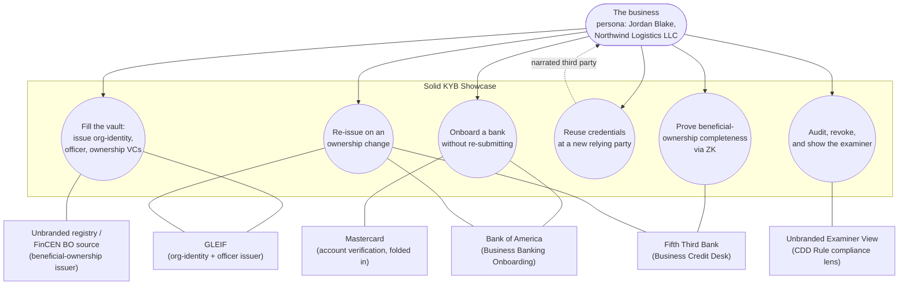

# Use Case: GLEIF-Anchored Business KYB Onboarding on Solid

> Concept demonstration — not affiliated with or endorsed by GLEIF, Bank of America, Fifth
> Third Bank, Mastercard, EDM Council/OMG, FinCEN, or any business registry, bank examiner,
> or regulator. Every stakeholder organisation named below is an *illustrative*, role-first
> casting ("modelled on X") carried over from the mortgage and lending showcases' regn-optics
> discipline (decision 0002 / R1–R8, `solid-mortgage` `docs/research/org-map.md`); no logos,
> trade dress, insignia, or claims of deposit insurance/agency approval appear anywhere in the
> build. This document follows the OMG / EDM Council use-case template (the standard EDMA UC
> format), matching the structure and depth of Demo 1 (`solid-mortgage/docs/use-case.md`) and
> Demo 2 (`solid-lending/docs/use-case.md`).

## I. Use Case Description

| Field | Value |
|---|---|
| **Use Case Name** | GLEIF-Anchored Business KYB Onboarding on Solid |
| **Use Case Identifier** | SOLID-KYB-01 (bead `sm-qrfu`, tracked in `jeswr/solid-mortgage`) |
| **Source** | Solid KYB Showcase (Demo 3) — EDMA Solid Community of Practice |
| **Point of Contact** | Jesse Wright — `63333554+jeswr@users.noreply.github.com` |
| **Creation / Revision Date** | 2026-07-22 |
| **Associated Documents** | `docs/research/kyb-demo-design.md` and `docs/research/demo3-poc-selection.md` (design of record, in `jeswr/solid-mortgage`); `packages/data-model/shapes/*.ttl` (SHACL); `packages/data-model/vocab/kyb.ttl` (project vocabulary); `packages/vc-kit/src/zk/*` (ZK prover/verifier + honesty panel); `packages/seeds/test/pod-integration.test.ts` (live-pod issue→verify→ZK-prove traceability); `apps/*/lib/branding.ts` and `apps/tour/content/walkthrough.json` (six-scene walkthrough script) |

## II. Use Case Summary

### Goal

Demonstrate, to EDMA member organisations, that a US business can prove **who it is and who
controls it once**, hold that proof in a Solid pod (the "Data Vault") it controls, and **reuse**
the same Verifiable Credentials at every bank and counterparty that needs them — instead of
re-submitting formation documents, EIN letters, and cap tables from scratch at every new banking
relationship. This is the organisational-identity/trust layer Demos 1 and 2 both explicitly
*deferred* ("vLEI is product-phase narrative only") — Demo 3 is where GLEIF finally appears as an
active **issuer** rather than a reference, and where a genuinely novel zero-knowledge predicate
(beneficial-ownership *completeness*, not a single hidden numeric comparison) gets built and
proven. Success for this use case is EDMA member organisations recognising their own real seat in
the Customer Due Diligence (CDD) value chain and choosing to sponsor a build-it-for-real partner
phase.

### Requirements

Grounded in `docs/research/kyb-demo-design.md` §1 (pain, quantified) and §3–§4 (data/ZK design):

- **R1 — Reusable organisational identity and ownership.** An Organisational-Identity credential
  and a Beneficial-Ownership credential issued once must be presentable, unmodified, to every
  downstream relying party — demonstrated by a **second bank** (Fifth-Third-modelled
  `bank-credit`) reading the *same* credentials a **first bank** (Bank-of-America-modelled
  `bank-onboarding`) already read, with zero re-collection (scene 4).
- **R2 — Non-disclosure at the pre-decision moment.** A business must be able to prove *"no
  undisclosed beneficial owner holds ≥ 25%"* to a bank's pre-decision credit screen without
  disclosing which owners are below threshold or any owner's exact percentage. Metric: the
  scene-3 ZK proof discloses only a boolean predicate result and a disclosed-owner *count* it
  independently recomputes from verified data — never a bare client-asserted count.
- **R3 — Freshness without re-verification from scratch.** When beneficial ownership changes
  (an owner sells their stake), the credential must be re-issuable through the *existing* grant,
  the stale credential's status-list entry must be provably revoked, and **both** banks already
  holding a grant must see the fresh ownership on their next read — neither re-runs KYB from
  scratch (scene 5).
- **R4 — Borrower/business visibility and control.** The business must be able to enumerate
  every grant (which bank/registrar, what was read, when), revoke a party's access, and see the
  revocation reflected immediately at the pod's own access-control layer — not merely a UI
  toggle (scene 6, `apps/vault/lib/grants/engine.ts`).
- **R5 — Regulatory grounding, stated precisely.** Every compliance claim must cite the *actual*
  live obligation: the bank Customer Due Diligence Rule, 31 CFR §1010.230 (each individual owning
  ≥ 25% of a legal-entity customer, plus one control person, identified and verified **at account
  opening at each new bank**) — never the Corporate Transparency Act's beneficial-ownership
  *reporting* requirement, which FinCEN's March 2025 interim final rule removed for US domestic
  companies. Demo copy says "each new bank," never "each new account," staying accurate against
  FinCEN's 13 Feb 2026 exceptive relief for same-bank repeat accounts.
- **R6 — Semantic grounding.** All pod/credential data is expressed in real, dereferenceable
  vocabularies — FIBO Business Entities (BE) primary, schema.org, W3C VC 2.0, ODRL, DPV, plus the
  one project-residue namespace — so the demo also delivers the FIBO-BE ↔ GLEIF-LEI ↔ FinCEN-CDD
  binding table EDMA's CoP has asked for (design §3.4).
- **R7 — Forgery resistance on every ZK surface.** No live proof may be accepted without an
  issuer-signed `kyb:ZkOperandAnchor` binding the proof's public input to a signed, non-revoked,
  subject-matched value; a proof whose disclosed statement does not match what the verified
  credential actually discloses must fail closed with a distinguishable error code
  (`STATEMENT_MISMATCH`), never a silent pass.

### Scope

**In scope:** the six-scene business journey (design §5) — three credentials issued into the
business's pod by a GLEIF-modelled and an unbranded-registry-modelled issuer; a first bank's full
disclosed KYB/CDD read; a second bank's zero-knowledge beneficial-ownership completeness proof at
its pre-decision credit screen, followed by disclosed access once it proceeds; a narrated
third-relying-party reuse beat; a beneficial-ownership change that re-issues and revokes rather
than re-verifies; and a consent-receipt ledger with grant/revoke and an unbranded Examiner View.
Five branded Next.js apps (`tour`, `vault`, `issuers`, `bank-onboarding`, `bank-credit`) plus
shared `packages/data-model` (vocab + SHACL + typed wrappers), `packages/vc-kit` (VC issue/verify/
status/reissue + the ZK layer), `packages/seeds` (persona seeding), and `packages/test-kit` (dev
Solid-server harness) — all merged to `main` in `jeswr/solid-kyb`.

**Explicitly out of scope for this use case (but in scope for a real build):** real LEI issuance
and real GLEIF vLEI (KERI/ACDC, ISO 17442-3) — this demo issues plain W3C VC 2.0 credentials
carrying an obviously-illustrative, ISO-17442-*shaped* LEI, never a live vLEI credential exchange;
a real FinCEN beneficial-ownership-registry query or a real bank CDD decisioning system; real
sanctions/adverse-media screening; a real Mastercard open-finance API call (folded in as a
narrated data flow inside `bank-onboarding`); the scene-4 third relying party as a live app (kept
narrated to hold the app count at five zone apps, design §2.2/§8.1); production-grade key custody
or HSM signing; externally audited ZK circuits (both the sparq estate and this package's own
bespoke Tier B completeness circuit are research-grade, pending cryptographer sign-off); real user
authentication/account recovery beyond a seeded demo login; and any real PII — every persona is
fictional (§III).

### Priority

Highest priority within Demo 3 — the design doc's scoring process (`demo3-poc-selection.md`,
weighted score 4.65/5) selected this KYB/beneficial-ownership use case over a runner-up insurance-
portability candidate (3.75/5) specifically because it opens a new B2B audience and finally
exercises GLEIF as an issuer; every app, credential shape, and ZK circuit in `jeswr/solid-kyb`
exists to make this six-scene journey demonstrable end to end.

### Stakeholders

All stakeholder-app castings are illustrative role assignments (design §2.1), each carrying the
non-affiliation disclaimer above and role-first framing ("modelled on X") throughout the apps.
Membership figures are sourced from an internal role-map sheet (snapshot 4 Jun 2026) and are
**flagged for re-verification before any real partner outreach**:

| Stakeholder | Role | EDMA member? |
|---|---|---|
| The business (persona: Jordan Blake, Managing Member of Northwind Logistics LLC) | Pod owner, principal actor | n/a — the business the showcase serves |
| **Verizon** (modelled) | Business Data Vault — pod, grants, consent-receipt ledger | Member¹ |
| **GLEIF** (modelled) | Organisational-identity + officer-authorization credential issuer | Member |
| *Unbranded business registry / FinCEN BO source* (modelled, unbranded) | Beneficial-ownership credential issuer | Not a member — external-approach target |
| **Bank of America** (modelled) | Business Banking Onboarding — full disclosed KYB/CDD relying party | Member |
| **Mastercard (Open Banking)** (modelled) | Business-account / cash-flow verification — folded into Business Banking Onboarding as a data flow, no dedicated app | Member¹ |
| **Fifth Third Bank** (modelled) | Business Credit Desk — ZK beneficial-ownership completeness relying party + credit-line underwriting | Member, Data Exchange Project Founder |
| CFPB/FinCEN examiner (represented generically as "Examiner View") | Regulator lens over the CDD Rule — unbranded, explicitly non-affiliated | Not a member; no agency branding used |
| **EDM Council / OMG (FIBO-BE)** with **GLEIF (LEI)** credited | Data/standards steward — the vocabulary this use case runs on | EDMA itself; GLEIF itself |

¹ Mastercard's and Verizon's EDMA membership are internal-role-map-sheet-only and **publicly
unconfirmed** — flagged for re-verification before any real outreach (mirrors Demo 1's identical
Mastercard footnote).

### Description

A US small/mid-size business today re-supplies the same formation documents, EIN letter, entity-
form evidence, and beneficial-ownership cap table to every bank it opens a relationship with, each
of which runs its own multi-day KYB/CDD grind: 70% of banks report losing business clients to slow
onboarding (Fintech Global), and AML/KYC/sanctions penalties reached $1.23B in H1 2025 — up 417%
year over year (Fenergo). A community-bank case study documents automated KYB verification cutting
onboarding from five days to under 24 hours (iComply). This use case replaces the re-collection
pattern with a **pod-centric, credential-based, consent-receipted** onboarding flow, played out as
a single business's six-scene journey across five branded stakeholder applications that are 1:1
castings of a real organisational-identity anchor, a real-registry-modelled beneficial-ownership
source, and two competing bank relying parties:

1. **Fill the vault** — a GLEIF-modelled issuer signs Organisational-Identity and
   Officer-Authorization credentials; an unbranded registry/FinCEN-BO-source-modelled issuer signs
   a Beneficial-Ownership credential listing all four owners' stakes — directly into the business's
   pod.
2. **Onboard without re-submitting** — the first bank runs its full KYB/CDD check by reading the
   disclosed credentials straight from the pod (CDD needs the actual values, not a proof); a
   Mastercard-modelled account-verification flow folds in; the account opens the same session.
3. **Prove ownership without exposing the cap table** — the business applies for a credit line at a
   second bank and proves, via zero-knowledge proof, that no undisclosed owner clears the CDD
   Rule's 25% threshold — without revealing the sub-threshold owners or anyone's exact percentage.
   Once the bank proceeds, the business grants full disclosed access for the real CDD record.
4. **Reuse, not re-collection** — a narrated third relying party (an insurance renewal) reads the
   *same* underlying credentials with zero re-collection, dramatizing the counterfactual to the
   $1.23B-penalty/70%-client-loss statistics.
5. **Nothing goes stale** — a beneficial owner sells their stake; the Beneficial-Ownership
   credential is re-issued through the existing grants and the stale credential is provably
   revoked; both banks see the fresh ownership on their next read without re-running KYB.
6. **Control, audit, and the regulator view** — the business reads its consent-receipt ledger,
   revokes a bank's access, and an unbranded Examiner View shows the CDD Rule satisfied through
   receipted grants rather than a filing.

The principal actor throughout is **the business**, acting through the Business Data Vault
(Verizon-modelled) app, in the person of its Managing Member/CEO, Jordan Blake. Every other party
is a secondary actor: an issuer, a KYB/CDD relying party, or a compliance lens, reached only
through a business-initiated grant or a business-initiated ZK proof presentation — never by silent
third-party access.

### Actors / Interfaces

**Primary actor:** the business (persona: Northwind Logistics LLC, acting through Jordan Blake),
via the `vault` app (Verizon-modelled Business Data Vault) — the only actor that both invokes the
use case (by consenting to each flow) and receives its benefit (faster, cheaper, more visible
onboarding across every relying party it approaches).

**Secondary actors** (systems/services acted upon or acting at the business's direction):

- **`issuers`** — one app, three flows: the GLEIF-modelled org-identity and
  officer-authorization flows, and the unbranded-registry/FinCEN-BO-source-modelled
  beneficial-ownership flow (mirrors Demos 1–2's multi-flow-single-app `verifications` pattern).
- **`bank-onboarding`** (Bank of America-modelled) — full disclosed KYB/CDD relying party; reads
  pod-granted credentials over `@jeswr/solid-pod-guard`'s `createServicePodFetch`, runs the real
  `verifyCredential` chain, and writes an APPROVE/DECLINE decision.
- **`bank-credit`** (Fifth Third-modelled) — ZK-verifying relying party; runs the Tier A/Tier B
  proof-verification gate chain at pre-decision, then (once proceeding) reads disclosed
  credentials for its own `kyb:CddDecisionRecord` at `/kyb/decisions/bank-credit`, distinct from
  `bank-onboarding`'s own record so two independent banks' decisions never collide.
- **`vault`** — the business's own pod-holder app: credential display, grants (`engine.ts`), the
  in-browser ZK prover (Tier A live UltraHonk, Tier B `kyb_completeness_scan_n8`), and the DPV
  consent-receipt ledger.
- **`tour`** — the EDMA CoP walkthrough shell; not part of the business's own journey but the
  pitch surface that frames it, including the unbranded Examiner View (`app/compliance/page.tsx`).
- **Pod host** — sparq `@jeswr/solid-server` (WASM) via `packages/test-kit`'s
  `startSolidServer` harness in dev/e2e.
- **FIBO Business Entities / GLEIF LEI / schema.org / W3C VC 2.0 / ODRL / DPV vocabularies** —
  the knowledge resources every pod resource and credential is expressed against (§VIII).

### Pre-conditions

- The business has an authenticated Solid session and a pod provisioned with a
  `profile/card#me` WebID every credential's `credentialSubject` (holder binding) equals.
- The `issuers` app is reachable and holds valid signing keys registered against its issuer WebID
  documents (`eddsa-rdfc-2022` for the VC layer; Schnorr-over-Baby-JubJub for the
  Beneficial-Ownership credential's ZK-commitment dual-signature).
- Each issuer's Bitstring Status List 1.0 resource is reachable for revocation checks
  (`packages/vc-kit/src/status.ts`).
- No prior grant exists for the bank being newly granted (a repeat grant against an already-live
  receipt is refused with 409 — `apps/vault/lib/grants/engine.ts`).

### Post-conditions

- The pod holds three SHACL-validated, holder-bound VC 2.0 credentials
  (`/kyb/credentials/org-identity`, `/kyb/credentials/beneficial-ownership`,
  `/kyb/credentials/officer-authorization`) plus two `kyb:ZkOperandAnchor` resources (per-owner
  threshold field, owner-array commitment field).
- Both `bank-onboarding` and `bank-credit` hold live, WAC-granted read access scoped to exactly
  the credentials they were granted; each has written its own `kyb:CddDecisionRecord` at a
  bank-scoped path.
- A DPV consent-receipt ledger in the pod records every grant and revoke as an immutable history.
- After scene 5, the Beneficial-Ownership credential's original status-list index is revoked; its
  replacement carries Jordan's new 60% stake and a fresh validity window.

### Triggers

External/temporal: the business choosing to start the journey in the `tour`/`vault` app
(external, user-initiated); the scene-5 ownership change firing when Marcus Webb sells his stake
to Jordan (external, business-initiated, not a fabricated clock — the pod is re-seeded with real
`validFrom`/`validUntil` windows); the scene-2/scene-3 bank decision routes firing on the
business's explicit "run the KYB check" / "run the ownership proof" action, never autonomously.

### Performance Requirements

- ZK proving: Tier A (`filter_int_d4`, per-owner ≥ 2500 bps threshold) is live, in-browser
  UltraHonk proving — the same committed sparq circuit family the mortgage and lending showcases
  use for their own threshold proofs. Tier B (`kyb_completeness_scan_n8`) is this package's own
  bespoke, project-authored circuit, compiled with the identical pinned toolchain
  (`@noir-lang/noir_js`, `@aztec/bb.js`, `nargo` — versions pinned in `packages/vc-kit/src/zk/
  circuits/registry.ts`); unlike the mortgage/lending showcases' composed Tier B (which needs
  native Poseidon2/Schnorr witness building and is therefore proved offline), this circuit's
  witness is cheap enough to prove **live** — a deliberate scope-down from a single
  scan+filter+issuer+revocation manifest to a completeness-only circuit, run alongside ordinary
  credential verification for the issuer/revocation checks.
- Every live proof is checked against the mandatory operand-anchor gate chain: structural →
  nonce (single-use, session-bound) → challenge → statement (`STATEMENT_MISMATCH` on mismatch) →
  anchor signature/shape/status/subject/field/operand-equality (`packages/vc-kit/src/zk/
  verifier.ts`).
- Credential/status-list reads are simple authenticated GETs against `createServicePodFetch`
  (client_credentials + DPoP); no anonymous fallback exists in any server route — an
  unconfigured service identity or OIDC-issuer allowlist answers 503, never proceeds.
- `packages/seeds/test/pod-integration.test.ts` exercises the full issue → read-back → verify →
  Tier-B-prove round trip against a **real** `@jeswr/solid-server` instance (never a mocked pod),
  the demo's executable traceability oracle for the credential/ZK layer.

### Assumptions

- Every credential-issuing "issuer" app in the demo *is* the seeded issuer identity (same IRI,
  same signing key) — a stand-in for the real vendor integration a partner-phase build would make
  over GLEIF's and a business registry's actual APIs.
- The bank KYB/CDD decision logic in both `bank-onboarding` and `bank-credit` is a simplified,
  illustrative rules engine (entity-form check, LEI presence, ≥25%-owner identification, control-
  person identification, ZK-gate pass/fail) — not either bank's real CDD decisioning system.
- Demo persona and its four beneficial owners are entirely fictional (see §III); ownership
  percentages were deliberately pinned to create a real disclosed/undisclosed boundary at the
  25% (2,500 bps) threshold rather than to imply anything about the individuals represented.

### Open Issues

- The `kyb:` project vocabulary (`https://solid-kyb-vocab.vercel.app/kyb#`) is fully specified
  and committed (`packages/data-model/vocab/kyb.ttl`), but **the Vercel project publishing it at
  that URL is not yet live** (a direct `Accept: text/turtle` fetch returns 404 as of this
  document's authoring, 2026-07-22) — this is the same class of gap flagged as a follow-up bead
  for Demo 2's vocabulary (`lend-vocab-publish`); a `kyb-vocab-publish` follow-up bead is needed
  before `lint:iris`' 7-day-cache CI gate can pass on a fresh cache and before any `kyb:` IRI in
  this document can be called genuinely dereferenceable rather than "designed to be."
- Tier A's per-owner operand anchors for Jordan's and Priya's *actual* bps values cannot yet be
  minted in this environment: doing so requires sparq's native `encode_int_literal` bridge,
  gated on a local `SPARQ_CHECKOUT` the seeding environment does not have
  (`apps/vault/lib/server/kyb-issuance.ts`). The seeded demo anchors a Tier A "sample owner" proof
  with a real, provenance-tracked captured encoding from `@kyb/vc-kit`'s own test fixtures instead
  of a fabricated one — honestly disclosed, but not yet the genuine per-owner encoding for this
  persona's exact values.
- The Tier B completeness circuit (`kyb_completeness_scan_n8`) is bespoke, project-authored code —
  not a sparq-audited circuit family member — and is research-grade, pending external
  cryptographer sign-off, same as the sparq estate underlying Tier A.
- Mastercard's and Verizon's EDMA membership status is internally sourced and publicly
  unconfirmed — must be re-verified before any real partner outreach.
- No EDMA member exists for the beneficial-ownership registry/FinCEN-BO-source role or the
  regulator role — external-approach targets for a partner phase.

## III. Usage Scenarios

Both scenarios use the **same fictional demo persona** — no real PII anywhere in this document or
in the underlying seed data (`packages/data-model/src/personas.ts`). The illustrative LEI is an
ISO-17442-shaped, checksum-valid, obviously-non-issued identifier (LOU prefix `9999`, never
GLEIF-accredited — `packages/data-model/src/lei.ts`), plainly marked `kyb:isIllustrativeLei true`
on every credential that carries it.

**Scenario 1 — Jordan Blake, opening business banking without the filing-cabinet grind.** Jordan
Blake (persona; Managing Member & CEO, Northwind Logistics LLC, a fictional freight/logistics SMB,
Kansas City, MO) needs a business checking account for Northwind. Rather than mailing formation
documents, an EIN letter, and an ownership schedule to Bank of America-modelled Business Banking
Onboarding, Jordan first has Northwind's Data Vault filled: the GLEIF-modelled seat of `issuers`
signs an Organisational-Identity credential (LEI `9999NWLOGISTICS0018` — illustrative, ISO
17442-shaped; entity legal form LLC) and an Officer-Authorization credential naming Jordan as
Managing Member and signatory; the unbranded registry/FinCEN-BO-source-modelled seat signs a
Beneficial-Ownership credential listing all four owners' basis-points stakes: Jordan 42%
(4,200 bps), Priya Nandakumar 28% (2,800 bps), Marcus Webb 18% (1,800 bps), Dana Reyes 12%
(1,200 bps) — summing to the whole cap table (scene 1). Jordan grants Business Banking Onboarding
a scoped, time-boxed read of the Organisational-Identity and Beneficial-Ownership credentials; a
consent receipt lands in the vault's ledger before the bank reads a byte. The bank's KYB/CDD
check runs the CDD Rule's own test directly on issuer-signed data — entity legal form, LEI, and
every owner at or above 25% (Jordan and Priya), plus Jordan as control person — and a
Mastercard-modelled account-verification flow confirms the operating account. The account opens
the same session (scene 2). This scenario exercises R1 and R6 most directly: the credential
shapes must carry enough FIBO-BE-typed structure
(`fibo-be-oac-opty:EntityOwnership`/`hasOwningEntity`/`hasOwnedEntity`,
`fibo-be-le-lei:hasOwnershipPercentage`) that a bank's own CDD engine can evaluate the Rule's
25%-threshold test purely from typed triples read off a real Solid pod.

**Scenario 2 — the credit line, the completeness proof, and the stake sale.** Thirty (simulated)
days later, Jordan applies for a business credit line at Fifth-Third-modelled Business Credit
Desk. Rather than disclosing Northwind's full cap table at the pre-decision screen, Jordan proves
in-browser, via zero-knowledge proof, that no undisclosed owner clears the CDD Rule's 25%
threshold — Tier A (live UltraHonk) proves each disclosed ≥25% owner's hidden basis-points value
really is ≥ 2,500 without revealing the exact percentage; Tier B (`kyb_completeness_scan_n8`)
proves the *disclosed set is complete* — no undisclosed owner also clears 25% — over the full,
hidden four-owner array (scene 3). The desk verifies both proofs against a bank-minted single-use
nonce and the issuer-signed operand anchors, computing the disclosed-owner count *itself* from the
credential it already verified rather than trusting a client-asserted number. The credit line
proceeds pre-qualified; Jordan then grants full disclosed access for the real CDD record. Some
time later, Marcus Webb sells his 18% stake to Jordan, who now holds 60%; the Beneficial-Ownership
credential is re-issued through the *existing* grants at both banks, the stale credential's
status-list entry is revoked, and both Bank of America-modelled and Fifth-Third-modelled banks see
the fresh ownership on their next read — neither re-runs KYB from scratch (scene 5). This scenario
exercises R2, R3, and R7 together: the completeness proof's non-disclosure guarantee, the
freshness-through-reissue-not-reverification pattern, and the forgery-resistance gate chain that
makes a bare filter proof (without its issuer-signed anchor) worthless.

## IV. Basic / Normal Flow of Events

This is the composite flow across scenarios 1 and 2 above, mirroring the six scenes scripted in
`apps/tour/content/walkthrough.json` and exercised by each app's own route-level test suite
(`apps/issuers/test/issuer-rail.test.ts`, `apps/bank-onboarding/test/onboarding-rail.test.ts`,
`apps/bank-credit/test/decision-rail.test.ts`, `apps/vault/test/grant-rail.test.ts`,
`apps/vault/test/zk-prove.test.ts`) plus `packages/seeds/test/pod-integration.test.ts`'s live-pod
round trip. Each scene is a real state transition on the pod, not a simulated screen transition.

| Step | Actor (Person) | Actor (System) | Description |
|---|---|---|---|
| 1 | Jordan (business) | `apps/vault` | Vault shows Northwind's empty credential shelf, grants panel, and consent-receipt ledger — nothing issued yet. |
| 2 | Jordan | `apps/issuers` (org-identity flow) | GLEIF-modelled registrar signs an `OrganisationalIdentityCredential` (illustrative LEI, entity legal form `LLC`) into `/kyb/credentials/org-identity`, holder-bound to Northwind's WebID. |
| 3 | Jordan | `apps/issuers` (officer-authorization flow) | Same GLEIF-modelled seat signs an `OfficerAuthorizationCredential` naming Jordan as Managing Member/CEO and signatory into `/kyb/credentials/officer-authorization`. |
| 4 | Jordan | `apps/issuers` (beneficial-ownership flow) | Unbranded registry/FinCEN-BO-source-modelled seat signs a `BeneficialOwnershipCredential` listing all four owners' bps stakes into `/kyb/credentials/beneficial-ownership`, dual-signed (`eddsa-rdfc-2022` + Schnorr-over-Baby-JubJub) for the scene-3 ZK commitment. |
| 5 | Jordan | `apps/vault` | Jordan reviews the three issued VCs; each shows verified (signature + issuer trust + window + not-revoked, via `@kyb/vc-kit`'s `verifyCredential`). |
| 6 | Jordan | `apps/bank-onboarding` | Jordan grants Business Banking Onboarding scoped, time-boxed read access to the Organisational-Identity and Beneficial-Ownership credentials; a DPV consent receipt lands in the ledger before the read. |
| 7 | — | `apps/bank-onboarding` | The bank's service identity reads the granted credentials over `createServicePodFetch` and runs the real fail-closed `verifyCredential` chain on each. |
| 8 | — | `apps/bank-onboarding` | The KYB/CDD check evaluates the CDD Rule's own test on the verified data (entity legal form, LEI presence, every owner ≥ 25%, one control person) plus the narrated Mastercard-modelled account-verification flow, and writes a `kyb:CddDecisionRecord` (Opened) at a bank-scoped path. |
| 9 | Jordan | `apps/bank-credit` | Jordan starts a credit-line application; the desk mints per-session Tier A + Tier B single-use challenge nonces (`api/decision` challenge seam). |
| 10 | Jordan | `apps/vault` (in-browser ZK prover) | Jordan proves, in-tab, `ownershipPercentageBps ≥ 2500` for each disclosed ≥25% owner (Tier A, live UltraHonk) and the owner-array completeness statement (Tier B, `kyb_completeness_scan_n8`), each bound to the issuer-signed operand anchor and the bank's nonce — no owner's exact percentage ever leaves the browser. |
| 11 | — | `apps/bank-credit` | The desk verifies both proofs: gate chain (structural → nonce → challenge → statement → anchor signature/status/subject/field/operand-equality); computes the disclosed ≥25%-owner count itself from its own verified read of the credential, never a client-claimed count. |
| 12 | — | `apps/bank-credit` | Both proofs pass; the desk proceeds toward a pre-qualified credit line and writes a `kyb:CddDecisionRecord` (Opened) at `/kyb/decisions/bank-credit`, distinct from `bank-onboarding`'s own record path. |
| 13 | Jordan | `apps/vault` | Jordan grants Business Credit Desk full disclosed access to the Organisational-Identity and Beneficial-Ownership credentials for the real CDD record — the ZK screen ran pre-decision only. |
| 14 | — (narrated) | `apps/vault` / `apps/tour` | A third, unbranded relying party (Northwind's insurance renewal) is narrated reading the *same* credentials through the same grant mechanism — the vault's grants panel shows both banks scoped to one underlying credential set, never a third copy. |
| 15 | — (business event) | `apps/vault` | Marcus Webb sells his 18% (1,800 bps) stake to Jordan, who now holds 60% (6,000 bps); the vault records the ownership change. |
| 16 | Jordan | `apps/issuers` (beneficial-ownership flow) | The registrar re-issues the `BeneficialOwnershipCredential` with the new split across the remaining three owners, through the *existing* grants; the stale credential's Bitstring Status List entry is set to revoked. |
| 17 | — | `apps/bank-onboarding`, `apps/bank-credit` | Both banks' next scoped read resolves the fresh credential automatically through the grants already in place — neither re-runs its KYB/CDD check. |
| 18 | Jordan | `apps/vault` | Jordan opens the consent-receipt ledger: every grant/revoke, timestamped, listed as an immutable history. |
| 19 | Jordan | `apps/vault` | Jordan revokes Business Banking Onboarding's access after the relationship winds down; the grant stops resolving at the pod's own WAC layer immediately, recorded in the ledger. |
| 20 | — | `apps/tour` (Examiner View) | The unbranded Examiner View reads a scoped, receipted regulator grant over the same ledger, showing the CDD Rule's beneficial-ownership identification obligation satisfied through inspectable grants rather than a filing. |

## V. Alternate Flow of Events

**V.a — Unresponsive issuer.** If `apps/issuers` cannot be reached at scene 1 (network failure,
issuer service down), the vault shows a live-status indicator rather than blocking silently; the
business can retry or proceed with whichever credentials did land, and any bank-side flow that
depends on a missing credential reports it explicitly absent rather than proceeding without
evidence.

| Step | Actor (Person) | Actor (System) | Description |
|---|---|---|---|
| 1 | Jordan | `apps/issuers` | Jordan requests credential issuance. |
| 2 | — | `apps/issuers` | Issuer request fails or times out. |
| 3 | — | vault/issuers UI | Jordan is shown an honest failure state, not a spinner or a silently mocked success. |
| 4 | Jordan | `apps/issuers` | Jordan retries; on repeated failure, proceeds with fewer credentials, and any bank check requiring the missing evidence explicitly reports it absent. |

**V.b — Revoked or expired credential presented.** If a credential's status-list entry has been
revoked (e.g. mid-flow re-issue superseding the original in scene 5) or its validity window has
lapsed, any verifier — either bank's KYB/CDD route — must fail closed.

| Step | Actor (Person) | Actor (System) | Description |
|---|---|---|---|
| 1 | — | Verifier (`bank-onboarding` or `bank-credit`) | Verifier runs the full `verifyCredential` chain: SHACL shape, validity window, Bitstring Status List lookup, `eddsa-rdfc-2022` signature. |
| 2 | — | Verifier | Status-list lookup returns revoked, or `now > validUntil`. |
| 3 | — | Verifier | Verification fails with an explicit error, never a silent pass; the CDD/decision route declines with the specific failure reason. |
| 4 | Jordan | `apps/issuers` | Jordan is directed to the re-issue flow (Basic Flow step 16) rather than the flow proceeding on stale evidence. |

**V.c — ZK proof forged, tampered, or replayed.** Because a bare Tier A/Tier B proof is
forgeable without its issuer-signed operand anchor, and because tampered proof bytes or a reused
nonce must never pass, the verifier must reject any presentation failing the anchor, nonce, or
statement gates (`packages/vc-kit/test/zk-completeness.test.ts`'s "tampered proof bytes reject"
and nonce-reuse cases).

| Step | Actor (Person) | Actor (System) | Description |
|---|---|---|---|
| 1 | Jordan | `apps/vault` (in-tab prover) | Jordan generates a Tier A or Tier B proof for a statement. |
| 2 | — | Bank verify route (`bank-onboarding`/`bank-credit`) | Verifier checks: structural validity → single-use nonce not yet consumed → challenge matches this session → public-input statement matches the advertised predicate → anchor signature/status/subject-WebID/field/operand-encoding equality. |
| 3 | — | Bank verify route | Any check fails — including tampered proof bytes or a replayed nonce — the specific error code is returned (e.g. `STATEMENT_MISMATCH`, `NONCE_INVALID`, `CHALLENGE_MISMATCH`); the account/credit decision declines with that reason, never a silent pass. |
| 4 | Jordan | `apps/vault` | Jordan is shown the honesty-panel explanation (proof rejected, why) and may re-attempt with a fresh challenge. |

**V.d — A hidden ≥ 25% owner makes the disclosed-completeness claim unsatisfiable.** If Northwind
attempted to disclose only two of three owners actually at or above 25% — i.e. an undisclosed
owner really does hold ≥ 2,500 bps — the honest Tier B statement for the *true* hidden array can
never equal the dishonestly-claimed disclosed count, so the proof is unsatisfiable/rejects with
`STATEMENT_MISMATCH` (`packages/vc-kit/test/zk-completeness.test.ts`, "THE COMPLETENESS
REGRESSION: undisclosed ≥ 25% owner is UNSATISFIABLE").

| Step | Actor (Person) | Actor (System) | Description |
|---|---|---|---|
| 1 | — | `apps/bank-credit` | The desk independently recomputes the disclosed ≥25%-owner count from its own verified read of the `BeneficialOwnershipCredential` — never trusting a client-supplied count. |
| 2 | Jordan | `apps/vault` (in-tab prover) | A proof is generated claiming a disclosed count that omits an actual ≥25% owner. |
| 3 | — | `apps/bank-credit` verify route | Tier B's statement gate compares the proof's public `disclosedCount` input against the bank's own independently recomputed count; they cannot match if an owner was hidden — `STATEMENT_MISMATCH`. |
| 4 | — | `apps/bank-credit` | The KYB/CDD decision is written `Declined`, with the specific reason "cannot rule out an undisclosed ≥25% beneficial owner" — never a silent approve. |

**V.e — Repeat/duplicate grant attempt.** The grants engine must refuse re-granting an
already-live receipt, and refuse re-revoking an already-revoked one, rather than silently
duplicating ACL state.

| Step | Actor (Person) | Actor (System) | Description |
|---|---|---|---|
| 1 | Jordan | `apps/vault` | A live grant receipt already exists for (bank, credential). |
| 2 | Jordan | `apps/vault` | Jordan (or a replayed request) attempts to grant the same (agent, resource) pair again. |
| 3 | — | `apps/vault` grants engine | Request is refused with HTTP 409 ("access is already granted and recorded"); the ACL is confirmed unchanged. The symmetric case (re-revoking an already-revoked grant) is refused the same way ("access is already revoked and recorded"). |

## VI. Use Case and Activity Diagram(s)

**Figure 1 — Use case diagram: the business and the five stakeholder roles.**

**Figure 2 — Activity diagram: the six-scene flow (mirrors `apps/tour/content/walkthrough.json`).**

```mermaid
flowchart TD
    Start([Jordan starts the journey]) --> S1

    subgraph S1["Scene 1 — Fill the vault"]
        direction TB
        A1[GLEIF-modelled registrar signs<br/>OrganisationalIdentityCredential] --> A2[Same registrar signs<br/>OfficerAuthorizationCredential]
        A2 --> A3[Registry/FinCEN-BO-modelled seat<br/>signs BeneficialOwnershipCredential<br/>dual-signed for ZK]
    end

    S1 --> S2

    subgraph S2["Scene 2 — Onboard without re-submitting"]
        direction TB
        B1[Jordan grants Business Banking<br/>Onboarding a scoped read] --> B2[Bank verifies credentials<br/>fail-closed, disclosed]
        B2 --> B3{CDD checks pass?}
        B3 -->|yes| B4[Account opened:<br/>CddDecisionRecord Opened]
        B3 -->|no| B5[Declined, reasons listed]
    end

    S2 --> S3

    subgraph S3["Scene 3 — Prove ownership without exposing the cap table"]
        direction TB
        C1[Bank mints Tier A + Tier B<br/>single-use nonces] --> C2[Jordan proves per-owner<br/>threshold AND completeness in-browser]
        C2 --> C3{Anchor + nonce +<br/>statement checks pass?}
        C3 -->|no, incl. hidden owner| C4[STATEMENT_MISMATCH:<br/>declined]
        C3 -->|yes| C5[Pre-qualified credit line;<br/>Jordan grants disclosed access]
    end

    S3 --> S4

    subgraph S4["Scene 4 — Reuse, not re-collection"]
        direction TB
        D1[Grants panel: both banks scoped<br/>to the SAME credential set] --> D2[Third relying party narrated:<br/>zero re-collection]
    end

    S4 --> S5

    subgraph S5["Scene 5 — Nothing goes stale"]
        direction TB
        E1[Marcus sells 18% stake to Jordan] --> E2[Registrar re-issues<br/>BeneficialOwnershipCredential]
        E2 --> E3[Stale credential's status<br/>index REVOKED]
        E3 --> E4[Both banks' next read<br/>resolves fresh ownership]
    end

    S5 --> S6

    subgraph S6["Scene 6 — Control, audit, and the regulator view"]
        direction TB
        F1[Jordan reads the consent-<br/>receipt ledger] --> F2[Jordan revokes a bank's access]
        F2 --> F3[Examiner View reads the same<br/>ledger: CDD Rule satisfied<br/>via receipted grants]
    end

    S6 --> End([Business ready for<br/>the next bank, one grant away])
```

## VII. Competency Questions

Grounded exclusively in the real, dereferenceable IRIs the pod/credential data is actually
expressed in (`packages/data-model/src/vocab/{external,kyb}.ts`, `packages/data-model/vocab/
kyb.ttl`): FIBO Business Entities (`https://spec.edmcouncil.org/fibo/ontology/BE/...`, all
`Release`-maturity modules, verified `Accept: text/turtle` → `200 text/turtle`, 2026-07-22), OMG
Commons (`https://www.omg.org/spec/Commons/Organizations/`,
`https://www.omg.org/spec/Commons/Identifiers/`, imported by FIBO-BE), schema.org
(`https://schema.org/`), W3C VC 2.0 (`https://www.w3.org/2018/credentials#`), DPV
(`https://w3id.org/dpv#`), ODRL (`http://www.w3.org/ns/odrl/2/`), and the project residue
vocabulary designed for `https://solid-kyb-vocab.vercel.app/kyb#` (§II Open Issues notes its
publish is still pending). No IRI in this section is minted for this document — every one already
appears in a committed SHACL shape or typed wrapper.

**CQ1 — "Does the beneficial-ownership evidence this business disclosed to a bank's pre-decision
screen actually rule out an undisclosed ≥ 25% owner — or could the business be hiding one?"**

This is exactly the scene-3 ZK gate. Starting from the presented Tier B proof and the anchor at
`kyb:field = kyb:beneficialOwnershipArrayCommitment`, the verifying bank (i) reads and
`verifyCredential`s the `BeneficialOwnershipCredential` at `/kyb/credentials/beneficial-ownership`
(typed `cred:VerifiableCredential`/`kyb:BeneficialOwnershipCredential`, subtype-linked via
`kyb:hasOwnershipRecord` to each `fibo-be-oac-opty:EntityOwnership` member); (ii) independently
**recomputes** the disclosed ≥25%-owner count from that verified data — never a client-asserted
number; (iii) verifies the Tier B proof's public statement (`threshold`, `disclosedCount`,
`expected`) against that independently-computed count and the anchor's committed owner-array
encoding. Example answer (from the seeded scene-3 state): "Yes, ruled out — the completeness proof
verifies against a disclosed count of 2 (Jordan and Priya, both ≥ 2,500 bps), matching what the
bank itself computed from the verified credential; no undisclosed owner clears 25%." If Northwind
instead tried to disclose only Jordan while omitting Priya (a real ≥25% owner), the bank's
independently-computed count (2) would not equal the dishonest claim's count (1), and the proof's
statement gate would fail with `STATEMENT_MISMATCH` — the honest completeness statement for the
*true* hidden array is provably unsatisfiable against a dishonest disclosed count (V.d). **Why the
ZK approach beats the obvious alternative:** the obvious alternative is a bank simply trusting
whatever ownership list a business hands over — exactly today's CDD-form practice, unverifiable
against anything but the business's own word. Because the completeness statement is proved against
an issuer-signed commitment over the *full* (hidden) owner array, and because the bank computes
its own comparison count from data it already verified rather than trusting the presenter, a
business cannot selectively omit an owner without the proof becoming cryptographically
unsatisfiable — a guarantee no unverified spreadsheet or PDF cap table can offer.

**CQ2 — "For this business, what is each disclosed beneficial owner's typed relationship to the
legal entity, and does the entity's LEI-anchored identity match consistently across every
credential presented?"**

Starting from `/kyb/credentials/org-identity` (typed `cred:VerifiableCredential`/
`kyb:OrganisationalIdentityCredential`), the answer follows `cred:credentialSubject` to the
business's own WebID node, typed `fibo-be-le-lei:LEIRegisteredEntity` ⊓
`fibo-be-le-lp:BusinessEntity` ⊓ `schema:Organization`, and reads its LEI via
`cmns-id:isIdentifiedBy` → a `fibo-be-le-lei:LegalEntityIdentifier` node (the ISO 17442 string,
`kyb:isIllustrativeLei true`) and its entity legal form via `fibo-be-le-lei:hasLegalForm`. A
SPARQL query then joins to `/kyb/credentials/beneficial-ownership`'s
`kyb:hasOwnershipRecord`-linked `fibo-be-oac-opty:EntityOwnership` members, each carrying
`fibo-be-oac-opty:hasOwningEntity` (the owner) and `fibo-be-oac-opty:hasOwnedEntity` (the *same*
business WebID) — a structural cross-check that every ownership record really does point back at
the one LEI-anchored entity, not a different or drifted subject. Example answer (seeded persona
Northwind Logistics LLC): the LEI `9999NWLOGISTICS0018` and `kyb:EntityLegalForm-LLC` appear
identically on the Organisational-Identity credential and are referenced by `hasOwnedEntity` on
all four `EntityOwnership` records in the Beneficial-Ownership credential — Jordan Blake
(`hasOwningEntity`, 42%), Priya Nandakumar (28%), Marcus Webb (18%), Dana Reyes (12%), summing to
100%. **Why the semantic/provenance approach beats the obvious alternative:** the obvious
alternative is a bank cross-referencing a formation certificate PDF against a separately-submitted
ownership spreadsheet by hand — exactly the multi-day document-reconciliation grind the KYB pain
statistics describe. Because both documents are typed FIBO-BE triples referencing the *same*
holder-bound WebID, an auditor or a second bank's own QA process can mechanically verify entity-
identity consistency across every credential in one SPARQL join, rather than trusting that two
independently-submitted paper documents describe the same legal entity.

**CQ3 — "Which relying parties currently hold access to this business's credentials, and when was
each grant made or revoked?"**

This is the scene-6 audit/Examiner-View question. Starting from the vault's consent-receipt
ledger, each `dpv:ConsentReceipt` resource carries `dpv:hasDataSubject` (the business's WebID),
`dpv:hasDataController` (the relying party's service WebID — e.g. `bank-onboarding`'s or
`bank-credit`'s configured service identity), `odrl:target` (the specific credential the receipt
concerns), `dpv:hasConsentStatus` (`dpv:ConsentGiven` or `dpv:ConsentWithdrawn`), and
`dcterms:issued` (the timestamp). A query over the full receipt set answers "who currently holds
access" by taking, per (data-controller, target) pair, the most recent receipt's status — never a
document count, since a revoke is itself a receipted resource, not a deletion. Example answer
(seeded scene-6 state): Business Banking Onboarding's org-identity and beneficial-ownership grants
show `dpv:ConsentGiven` at scene 2's timestamp, then `dpv:ConsentWithdrawn` at scene 6's
revocation; Business Credit Desk's disclosed grant (scene 3) remains `dpv:ConsentGiven`. **Why
provenance beats the obvious alternative:** the obvious alternative is a bank's own internal
access log, invisible to the business itself — exactly the "borrowers/businesses cannot enumerate
who holds their data" gap the mortgage showcase's own research identifies for consumer credit and
this demo carries into B2B KYB. Because every grant and revoke is a typed, timestamped DPV resource
the business's own pod holds, the business (and, through a scoped regulator grant, an examiner)
can query its own complete access history directly — not request it from every counterparty
separately.

## VIII. Resources

### Knowledge Bases, Repositories, or other Data Sources

| Data | Type | Description | Owner | Source | Access Policies & Usage |
|---|---|---|---|---|---|
| Business pod (Northwind Logistics LLC) | Remote (dev/test Solid pod via `@jeswr/solid-server`, WASM) | Three SHACL-validated VC 2.0 credentials, two ZK operand anchors, grant/ACL state, consent-receipt ledger | The business (WebID-controlled) | `packages/test-kit`'s `startSolidServer` harness; `packages/seeds` provisions the Northwind persona | WAC-controlled; business is the owner; grants scoped and revocable; `lint:iris` + pyshacl-equivalent shape checks gate CI |
| `docs/research/kyb-demo-design.md` + `docs/research/demo3-poc-selection.md` | Local (in `jeswr/solid-mortgage`) | Design of record: candidate scoring, quantified pain, credential/ZK design, six-scene script | Solid Mortgage/KYB Showcase research | `jeswr/solid-mortgage` `docs/research/` | Free; internal research artifact, web facts verified 2026-07-22 |
| `packages/data-model/shapes/*.ttl` | Local (in-repo SHACL) | Five closed SHACL shapes constraining every KYB pod resource (org-identity, beneficial-ownership, officer-authorization, ZK operand anchor, CDD decision record) | Solid KYB Showcase | `packages/data-model/shapes/` | Committed in-repo; shape-vs-fixture round trip tested in `packages/data-model/test/shapes.test.ts` |
| Bitstring Status List 1.0 resources (per issuer) | Remote (pod-hosted) | Revocation state for every issued KYB credential | `apps/issuers` (issuer identity) | `packages/vc-kit/src/status.ts`, hosted at `<issuer-origin>/status/<list>` | Public-read within the demo pod; fail-closed on lookup failure |
| `packages/seeds/test/pod-integration.test.ts` | Local (in-repo integration test) | The demo's executable traceability oracle: issue → read-back → verify → Tier-B-prove round trip against a real dev Solid server | Solid KYB Showcase | `packages/seeds/test/` | Runs in CI; asserts the credential/ZK layer against a live pod, never mocked |

### External Ontologies, Vocabularies, or other Model Services

| Resource | Language | Description | Owner | Source | Describes/Uses | Access Policies & Usage |
|---|---|---|---|---|---|---|
| FIBO — BE domain (LegalEntities: LEIEntities, LegalPersons, FormalBusinessOrganizations; OwnershipAndControl: OwnershipParties, Executives) | OWL, RDF/XML + Turtle | Legal-entity, LEI, ownership, and officer/signatory classes | Joint copyright: EDM Council + Object Management Group | `https://spec.edmcouncil.org/fibo/ontology/BE/...` — all fetched modules `Release` maturity, `200 text/turtle` on 2026-07-22 | Org-identity, beneficial-ownership, and officer-authorization credentials | Free; version-pinned, re-checked on FIBO quarterly releases |
| GLEIF LEI model (referenced, not directly imported) | Reference data model + RDF description | LEI/entity-legal-form/Level-2-Relationship-Record structure that FIBO-BE's own `cmns-av:adaptedFrom` annotations cite as source | GLEIF | `https://www.gleif.org/en/lei-data/semantic-representation-of-the-lei/lei-model-in-rdf-resource-description-framework` | Grounds the FIBO-BE ↔ GLEIF binding (§3.4 of the design doc); LEI string itself carried as a disclosed literal | Free; term-level GLEIF ontology IRIs are namespace-granularity only, per the mortgage showcase's own prior finding |
| OMG Commons — Organizations, Identifiers | OWL, Turtle | `cmns-org:LegalPerson`, `cmns-id:isIdentifiedBy` — imported by FIBO-BE and re-opened there | Object Management Group | `https://www.omg.org/spec/Commons/Organizations/`, `https://www.omg.org/spec/Commons/Identifiers/` | Organisational-identity credential's supertype and identifier-linking pattern | Free |
| W3C Verifiable Credentials Data Model 2.0 | RDFS vocab (Turtle) + JSON-LD context | Credential envelope terms: `VerifiableCredential`, `credentialSubject`, `issuer`, `validFrom`/`validUntil`, `credentialStatus`, `credentialSchema` | W3C | `https://www.w3.org/2018/credentials#`; context `https://www.w3.org/ns/credentials/v2` | Every one of the three issued credentials plus the ZK operand anchors | Free, open W3C Recommendation-track standard |
| schema.org | RDFS/JSON-LD vocab | `Organization`, `Person`, `PostalAddress`, name/address/job-title display terms | schema.org community group | `https://schema.org/` | Business display name/address, officer name/title | Free |
| DPV (Data Privacy Vocabulary) 2.x | RDFS/OWL, Turtle | `ConsentReceipt`, `ConsentGiven`, `ConsentWithdrawn`, `hasConsentStatus`, `hasDataSubject`, `hasDataController` | W3C Data Privacy Vocabularies and Controls CG | `https://w3id.org/dpv#` | Consent-receipt resources written on every grant/revoke (`apps/vault/lib/grants/receipt.ts`) | Free |
| ODRL 2.2 | RDFS/OWL, Turtle | `target` — names the concerned credential on a consent receipt | W3C | `http://www.w3.org/ns/odrl/2/` | Consent-receipt target linkage (`apps/vault/lib/grants/odrl.ts`) | Free |
| `kyb` — project residue vocabulary | Turtle (source of truth `vocab/kyb.ttl`, generated TS bindings) | Credential subtypes with no FIBO-BE-typed W3C-VC wrapper (`OrganisationalIdentityCredential`, `BeneficialOwnershipCredential`, `OfficerAuthorizationCredential`, `ZkOperandAnchor`, `CddDecisionRecord`), the ZK-provable `ownershipPercentageBps` scaled companion, `beneficialOwnershipArrayCommitment`, illustrative entity-legal-form/CDD-decision-status SKOS individuals, `isIllustrativeLei` | Solid KYB Showcase (Jesse Wright) | Designed for `https://solid-kyb-vocab.vercel.app/kyb#` (decision-0010 pattern) — **publish pending, see §II Open Issues** | Credential subtypes, decision statuses, ZK-provable fields, illustrative-LEI marker | Committed, CI-checked term-existence against the source Turtle; live dereferenceability not yet confirmed |

### Other Resources, Services, or Triggers

| Resource | Type | Description | Owner | Source | Access Policies & Usage |
|---|---|---|---|---|---|
| sparq `@jeswr/solid-server` (WASM distribution) | Dev/test service | Solid pod server hosting the demo pod in dev/test, via `packages/test-kit` | sparq-org | Vendored packed tarball (`vendor/jeswr-solid-server-0.1.0.tgz`) | Free; per-suite in-memory instances |
| sparq Noir/UltraHonk ZK stack (Tier A) + this package's bespoke `kyb_completeness_scan_n8` circuit (Tier B) | Cryptographic service (in-browser) | Tier A live per-owner threshold proof (`filter_int_d4`, shared sparq circuit family); Tier B live completeness proof (bespoke, project-authored) | sparq-org (Tier A) / Solid KYB Showcase (Tier B) | `@noir-lang/noir_js` + `@aztec/bb.js`, pinned versions (`packages/vc-kit/src/zk/circuits/registry.ts`); Tier B source at `packages/vc-kit/circuits/kyb_completeness_scan/src/main.nr` | Free/open-source; both research-grade, pending external cryptographer audit — mandatory honesty panel on every proving surface (`packages/vc-kit/src/zk/honesty.ts`) |
| `@jeswr/solid-vc` | Library | Issue + verify VCs fail-closed against pod-hosted issuer documents and Bitstring status lists | jeswr / solid-sdk | npm workspace package, wrapped by `@kyb/vc-kit` | Internal; consumed by `apps/issuers` |
| `@jeswr/fetch-rdf`, `@rdfjs/wrapper`, `@jeswr/rdf-serialize` | Libraries | RDF fetch/parse, typed pod-resource accessors, and house-sanctioned serialisation — the mandatory RDF-discipline seam | jeswr / solid-community | npm workspaces | Internal; used throughout `packages/data-model` and `apps/vault/lib/grants` |
| `@jeswr/solid-pod-guard` | Library | `resolveAuthorizedPod`/`createPodRouteGuard`/`createServicePodFetch` — the authenticated, fail-closed pod-route boundary every bank app's routes are built on | jeswr | Vendored tarball, `vendor/jeswr-solid-pod-guard-0.1.0.tgz` | Internal; consumed by `bank-onboarding`, `bank-credit`, `vault`, `issuers` |
| Vercel (per-app projects, deferred multi-zones per README) | Hosting/deploy service | Five app deployments plus the pending `solid-kyb-vocab` project | Vercel | Per-app `vercel.json` | Free tier; vocab-hosting project not yet stood up (§II Open Issues) |
| roborev | CI review service | Automated per-commit review | Internal tooling | `.roborev.toml` pattern carried from the mortgage/lending showcases | Runs async on every commit |

## IX. References and Bibliography

**Regulatory / standards references** (verified against FinCEN/eCFR/GLEIF sources as of
2026-07-22, per `docs/research/kyb-demo-design.md`):

- eCFR, 31 CFR §1010.230 (bank Customer Due Diligence Rule, beneficial ownership): https://www.ecfr.gov/current/title-31/subtitle-B/chapter-X/part-1010/subpart-C/section-1010.230
- FinCEN — removes beneficial-ownership reporting requirements for US companies (interim final rule, Mar 2025): https://www.fincen.gov/news/news-releases/fincen-removes-beneficial-ownership-reporting-requirements-us-companies-and-us
- Mintz — FinCEN eases beneficial-ownership re-verification (13 Feb 2026 exceptive relief): https://www.mintz.com/insights-center/viewpoints/54751/2026-02-18-fincen-eases-beneficial-ownership-verification
- GLEIF — Introducing the verifiable LEI (vLEI): https://www.gleif.org/en/organizational-identity/introducing-the-verifiable-lei-vlei
- GLEIF — LEI model in RDF: https://www.gleif.org/en/lei-data/semantic-representation-of-the-lei/lei-model-in-rdf-resource-description-framework
- GLEIF + BIS Innovation Hub — Project Aperta (cross-border open-finance vLEI trial): https://www.biometricupdate.com/202606/gleif-bis-test-vlei-as-trust-layer-for-cross-border-open-finance
- Fintech Global — 70% of banks lose business clients to slow onboarding: https://fintech.global/2025/10/08/70-of-banks-lose-clients-due-to-slow-onboarding/
- Fenergo — regulatory penalties up 417% in H1 2025 ($1.23B AML/KYC/sanctions): https://resources.fenergo.com/newsroom/regulatory-penalties-for-global-financial-institutions-skyrocket-417-in-h1-2025
- iComply — smarter KYB for US community banks (5-day → under-24-hour case study): https://icomplyis.com/smarter-kyb-for-u-s-community-banks-uncovering-risk-in-smb-accounts/

**Standards / ontologies:**

- FIBO home / governance: https://spec.edmcouncil.org/fibo/ and https://github.com/edmcouncil/fibo
- FIBO BE — Legal Persons: https://spec.edmcouncil.org/fibo/ontology/BE/LegalEntities/LegalPersons/
- FIBO BE — LEI Entities: https://spec.edmcouncil.org/fibo/ontology/BE/LegalEntities/LEIEntities/
- FIBO BE — Ownership Parties: https://spec.edmcouncil.org/fibo/ontology/BE/OwnershipAndControl/OwnershipParties/
- FIBO BE — Executives: https://spec.edmcouncil.org/fibo/ontology/BE/OwnershipAndControl/Executives/
- FIBO BE — Formal Business Organizations: https://spec.edmcouncil.org/fibo/ontology/BE/LegalEntities/FormalBusinessOrganizations/
- W3C VC Data Model 2.0: https://www.w3.org/TR/vc-data-model-2.0/
- W3C VC Data Integrity, eddsa-rdfc-2022: https://www.w3.org/TR/vc-di-eddsa/
- schema.org: https://schema.org/
- DPV 2.x: https://w3id.org/dpv
- ODRL 2.2: http://www.w3.org/ns/odrl/2/
- Solid protocol (WAC access control): https://solidproject.org/TR/wac

**Ontologies considered but not used, and why (mirrors the mortgage/lending showcases' own
findings):**

- **KERI/ACDC vLEI credentials (native GLEIF format)** — not W3C JSON-LD VCs, so out of scope for
  the pod's RDF model; org identity is represented as an illustrative, ISO-17442-shaped LEI string
  plus FIBO-BE typing instead, with on-screen copy stating vLEI as the product-phase upgrade path.
- **A bespoke project ontology for legal-entity/ownership concepts** — rejected in favour of
  FIBO Business Entities, which was found (re-verified 2026-07-22) to cover legal entities, LEI
  identity, ownership relations, and officer/signatory roles at real dereferenceable IRIs, with
  its own ontology-provenance annotations citing GLEIF's LEI/Relationship-Record format directly —
  only a small residue (credential subtypes, ZK-scaled fields, illustrative-LEI marker,
  decision-status individuals) needed a project vocabulary at all.

**Internal design-of-record documents (in `jeswr/solid-mortgage`):**

- `docs/research/demo3-poc-selection.md` — the scoring/selection design of record
- `docs/research/kyb-demo-design.md` — the full build design this document's every claim is
  grounded against
- `docs/research/org-map.md`, `docs/research/vocab.md`, `docs/research/zkp-fit.md` —
  cross-showcase research this demo's app-registry, vocab, and ZK design build on
- `decisions/0002.md` (app-set + branding), `0004.md` (VC rails), `0005.md` (ZK encodings),
  `0006.md` (consent-receipt ledger), `0007.md` (freshness vs. revocation), `0010.md` (vocab
  hosting), `0011.md`/`0013.md` (pod deploy modes), `0012.md` (ZK/presentation protocol)

## X. Notes

**What is simulated vs. what a real build would add** (honesty note, matching the pattern
established in `solid-mortgage`/`solid-lending`: every branded surface carries `simulated: true`
on API payloads and an honesty panel/banner — see each app's `lib/branding.ts` `honesty` field and
`packages/vc-kit/src/zk/honesty.ts`):

- **Real in this demo, nothing mocked on the credential/proof/grant path:** every credential
  signature (issuer apps sign as the seeded GLEIF-modelled and registry-modelled issuer
  identities with real `eddsa-rdfc-2022` keys, plus the Beneficial-Ownership credential's real
  Schnorr-over-Baby-JubJub dual-signature for the ZK commitment); every `verifyCredential` chain
  (SHACL shape, validity window, Bitstring status-list lookup, signature) fail-closed against
  pod-served documents; the Tier A live UltraHonk per-owner threshold proof and its full
  operand-anchor forgeability gate chain; the Tier B `kyb_completeness_scan_n8` completeness proof
  — this package's own bespoke, live-provable circuit, a genuine improvement in freshness over the
  mortgage/lending showcases' offline-precomputed Tier B pattern; every pod write (credential
  issuance, grant/revoke, consent receipt, both banks' `CddDecisionRecord`s); the entire chain is
  exercised against a **real** `@jeswr/solid-server` instance, never a mocked pod, in
  `packages/seeds/test/pod-integration.test.ts`.
- **Simulated / illustrative, and labelled as such in-app:** the business, all four beneficial
  owners, and the LEI are wholly fictional — the LEI is an ISO-17442-shaped, checksum-valid
  identifier using the unaccredited `9999` LOU prefix, never a real GLEIF-issued or
  GLEIF-accredited identifier, marked `kyb:isIllustrativeLei true` on every credential that
  carries it; both banks' KYB/CDD decision logic is a simplified, illustrative rules engine, not
  either bank's real CDD decisioning system; the Mastercard-modelled account-verification flow and
  the scene-4 third relying party (insurance renewal) are narrated data flows, not live API calls
  or a live app; no real sanctions/adverse-media screening occurs; no real bank account is opened
  and no money moves.
- **Partially real, with a disclosed gap:** Tier A's operand anchor for a *newly-generated*
  `ownershipPercentageBps` value cannot yet be minted in this environment — genuinely encoding
  Jordan's and Priya's exact bps values requires sparq's native `encode_int_literal` bridge, gated
  on a local `SPARQ_CHECKOUT` this build environment lacks. The seeder therefore anchors the demo's
  Tier A "sample owner" proof with a *real*, provenance-tracked encoding captured from `@kyb/vc-kit`'s
  own test fixtures (`packages/vc-kit/test/fixtures/operand-enc.json`) rather than fabricating one —
  honestly disclosed in `apps/vault/lib/server/kyb-issuance.ts`'s own header comment, but not yet
  the genuine per-owner encoding for this persona's actual values. This is the single largest
  build gap in the demo's ZK layer and the natural next follow-up once `SPARQ_CHECKOUT` is
  available in the seeding environment.
- **Vocabulary publish gap:** the `kyb:` project vocabulary is fully designed, committed as Turtle
  source (`packages/data-model/vocab/kyb.ttl`), and generates its own TypeScript bindings — but the
  `https://solid-kyb-vocab.vercel.app/kyb#` Vercel project that would make it genuinely
  dereferenceable is **not yet live** (confirmed 404 as of this document's authoring). This is the
  same class of gap already tracked as a follow-up for Demo 2's vocabulary
  (`lend-vocab-publish`); a `kyb-vocab-publish` follow-up is the natural next step.
- **Out of scope here, in scope for a real build:** real LEI issuance and real GLEIF vLEI
  (KERI/ACDC, ISO 17442-3) issuance/verification; a real FinCEN beneficial-ownership-registry
  query; a real bank CDD/KYB decisioning system; real sanctions/adverse-media screening; HSM-backed
  issuer key custody; externally audited ZK circuits (both the sparq Tier A estate and this
  package's own bespoke Tier B circuit); a live scene-4 third relying-party app; real user
  authentication/recovery beyond a seeded demo login; and, per every stakeholder org's illustrative
  casting, any actual vendor integration with GLEIF, Bank of America, Fifth Third Bank,
  Mastercard, or any bank examiner/regulator — none of whom have endorsed, sponsored, or been
  consulted on this concept demonstration.
- **Fair-representation posture:** the demo persona's four beneficial-ownership stakes were
  deliberately pinned to sum to exactly 10,000 bps with a real disclosed/undisclosed boundary
  straddling the 25% (2,500-bps) threshold — a design choice to give the completeness proof
  something genuine to demonstrate, not a claim about any real business's actual structure.
- **Traceability:** every basic-flow step above corresponds to a concrete, currently-passing
  assertion in one of `apps/issuers/test/issuer-rail.test.ts`,
  `apps/bank-onboarding/test/onboarding-rail.test.ts`,
  `apps/bank-credit/test/decision-rail.test.ts`, `apps/vault/test/grant-rail.test.ts`,
  `apps/vault/test/zk-prove.test.ts`, `packages/vc-kit/test/zk-completeness.test.ts`, and
  `packages/seeds/test/pod-integration.test.ts` — this document describes a system that runs
  today against the seeded dev pod, not an aspirational one.
